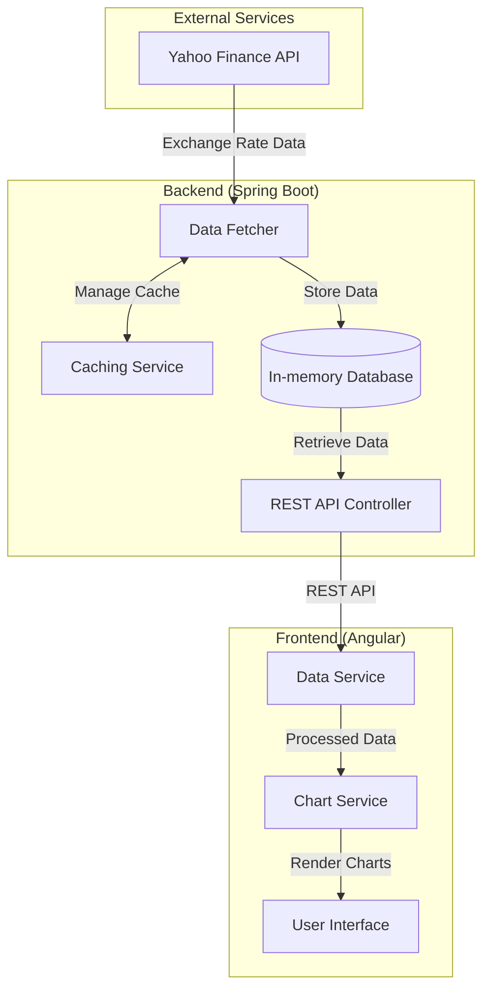
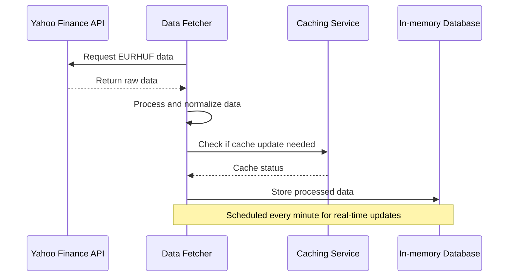
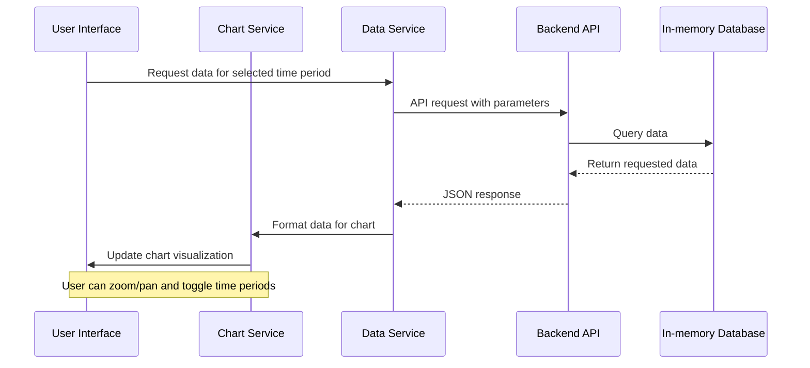

# EURHUF Chart App Architecture Plan

## 1. System Overview

The EURHUF Chart App will be a two-tier application consisting of:

1. **Backend**: A Spring Boot application that fetches EURHUF exchange rate data from Yahoo Finance API and provides endpoints for the frontend.
2. **Frontend**: An Angular application that uses Chart.js to visualize the EURHUF data with a clean, simple UI.

### System Architecture Diagram



## 2. Component Details

### 2.1 Backend Components

#### 2.1.1 Data Fetcher
- Responsible for fetching EURHUF exchange rate data from Yahoo Finance API
- Implements scheduled tasks to fetch real-time data at regular intervals
- Handles error scenarios and retries
- Processes and normalizes the raw data

#### 2.1.2 Caching Service
- Implements caching strategies to minimize external API calls
- Manages data freshness and invalidation
- Optimizes performance for frequently requested data

#### 2.1.3 REST API Controller
- Exposes endpoints for the frontend to consume
- Implements proper error handling and response formatting
- Provides data filtering and aggregation capabilities

#### 2.1.4 In-memory Database
- Stores historical exchange rate data
- Provides quick access to cached data
- Maintains data for the required 3-month historical period

### 2.2 Frontend Components

#### 2.2.1 User Interface
- Implements responsive design using Angular Material
- Provides intuitive controls for time period selection and chart interaction
- Displays loading states and error messages appropriately

#### 2.2.2 Chart Service
- Integrates with Chart.js library
- Configures chart options for optimal visualization
- Implements zoom/pan functionality and time period toggling

#### 2.2.3 Data Service
- Communicates with the backend API
- Handles data transformation for chart consumption
- Implements error handling and retry logic

## 3. API Design

### 3.1 Backend API Endpoints

#### 3.1.1 Current Exchange Rate
```
GET /api/v1/eurhuf/current
```
- Returns the current EURHUF exchange rate
- Response format:
```json
{
  "timestamp": "2025-05-30T09:00:00Z",
  "rate": 385.42,
  "change": 0.15,
  "changePercent": 0.04
}
```

#### 3.1.2 Historical Data
```
GET /api/v1/eurhuf/historical
```
- Query parameters:
  - `from`: Start date (ISO format)
  - `to`: End date (ISO format)
  - `interval`: Data interval (e.g., "1h", "1d", "1w")
- Returns historical EURHUF exchange rate data
- Response format:
```json
{
  "data": [
    {
      "timestamp": "2025-05-30T09:00:00Z",
      "rate": 385.42
    },
    {
      "timestamp": "2025-05-30T08:00:00Z",
      "rate": 385.27
    }
  ],
  "meta": {
    "interval": "1h",
    "count": 720
  }
}
```

#### 3.1.3 Time Range Data
```
GET /api/v1/eurhuf/range/:range
```
- Path parameter:
  - `range`: Predefined time range (e.g., "1d", "1w", "1m", "3m")
- Returns EURHUF data for the specified time range
- Uses the same response format as the historical endpoint

### 3.2 Data Formats

#### 3.2.1 Exchange Rate Data
```json
{
  "timestamp": "ISO-8601 timestamp",
  "rate": "Exchange rate value (float)",
  "change": "Change from previous value (float, optional)",
  "changePercent": "Percentage change (float, optional)"
}
```

## 4. Data Flow

### 4.1 Data Acquisition Flow



### 4.2 Frontend Data Request Flow



## 5. Key Technical Considerations

### 5.1 Backend Considerations

#### 5.1.1 Yahoo Finance API Integration
- Implement proper rate limiting to avoid API restrictions
- Handle API response errors gracefully
- Consider using a library like YahooFinanceAPI for Java

#### 5.1.2 Real-time Data Updates
- Implement WebSocket for pushing real-time updates to connected clients
- Use scheduled tasks for fetching data at regular intervals
- Implement proper error handling and retry mechanisms

#### 5.1.3 Performance Optimization
- Implement efficient caching strategies
- Use appropriate data structures for time-series data
- Implement data aggregation for different time intervals

#### 5.1.4 Error Handling
- Implement circuit breaker pattern for external API calls
- Provide meaningful error responses to the frontend
- Log errors with appropriate context for troubleshooting

### 5.2 Frontend Considerations

#### 5.2.1 Chart.js Integration
- Configure Chart.js for optimal performance with large datasets
- Implement proper zoom/pan functionality
- Handle time zone conversions correctly

#### 5.2.2 Responsive Design
- Ensure charts and UI elements adapt to different screen sizes
- Implement mobile-friendly controls for chart interaction
- Optimize for both desktop and mobile viewing

#### 5.2.3 State Management
- Use NgRx for state management if complexity warrants it
- Implement proper loading and error states
- Handle time period selection and chart configuration state

## 6. Project Structure

### 6.1 Backend Structure

```
eurhuf-backend/
├── src/
│   ├── main/
│   │   ├── java/
│   │   │   └── com/
│   │   │       └── eurhufapp/
│   │   │           ├── EurhufBackendApplication.java
│   │   │           ├── config/
│   │   │           │   ├── WebConfig.java
│   │   │           │   └── CacheConfig.java
│   │   │           ├── controller/
│   │   │           │   └── ExchangeRateController.java
│   │   │           ├── service/
│   │   │           │   ├── ExchangeRateService.java
│   │   │           │   ├── YahooFinanceService.java
│   │   │           │   └── CacheService.java
│   │   │           ├── model/
│   │   │           │   ├── ExchangeRate.java
│   │   │           │   └── TimeSeriesData.java
│   │   │           ├── repository/
│   │   │           │   └── ExchangeRateRepository.java
│   │   │           ├── exception/
│   │   │           │   ├── ApiException.java
│   │   │           │   └── ExceptionHandler.java
│   │   │           └── util/
│   │   │               └── DateTimeUtils.java
│   │   └── resources/
│   │       ├── application.properties
│   │       └── application-dev.properties
│   └── test/
│       └── java/
│           └── com/
│               └── eurhufapp/
│                   ├── controller/
│                   ├── service/
│                   └── repository/
├── pom.xml
└── README.md
```

### 6.2 Frontend Structure

```
eurhuf-frontend/
├── src/
│   ├── app/
│   │   ├── app.module.ts
│   │   ├── app.component.ts
│   │   ├── app-routing.module.ts
│   │   ├── core/
│   │   │   ├── services/
│   │   │   │   ├── exchange-rate.service.ts
│   │   │   │   └── chart.service.ts
│   │   │   ├── models/
│   │   │   │   ├── exchange-rate.model.ts
│   │   │   │   └── chart-options.model.ts
│   │   │   └── interceptors/
│   │   │       └── http-error.interceptor.ts
│   │   ├── features/
│   │   │   └── chart/
│   │   │       ├── chart.component.ts
│   │   │       ├── chart.component.html
│   │   │       ├── chart.component.scss
│   │   │       ├── components/
│   │   │       │   ├── time-selector/
│   │   │       │   └── chart-controls/
│   │   │       └── chart.module.ts
│   │   └── shared/
│   │       ├── components/
│   │       │   ├── header/
│   │       │   └── footer/
│   │       ├── directives/
│   │       └── pipes/
│   ├── assets/
│   │   ├── images/
│   │   └── icons/
│   ├── environments/
│   │   ├── environment.ts
│   │   └── environment.prod.ts
│   ├── index.html
│   ├── main.ts
│   └── styles.scss
├── angular.json
├── package.json
├── tsconfig.json
└── README.md
```

## 7. Development and Deployment Considerations

### 7.1 Development Environment
- Use Spring Boot DevTools for backend development
- Configure Angular CLI for efficient frontend development
- Set up proper CORS configuration for local development
- Use environment-specific configuration files

### 7.2 Testing Strategy
- Implement unit tests for backend services and controllers
- Use JUnit and Mockito for backend testing
- Implement unit tests for Angular services and components
- Use Jasmine and Karma for frontend testing
- Implement integration tests for API endpoints

### 7.3 Deployment Options
- Package backend as a standalone JAR file
- Build Angular frontend as static assets
- Consider containerization with Docker
- Implement CI/CD pipeline for automated testing and deployment

## 8. Future Expansion Possibilities
- Add more currency pairs
- Implement technical indicators
- Add user accounts for saving preferences
- Implement notifications for significant exchange rate changes
- Add export functionality for chart data